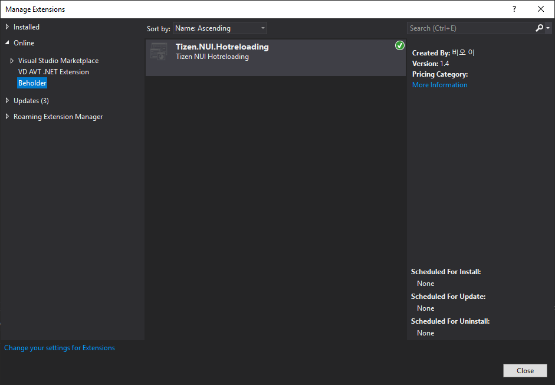
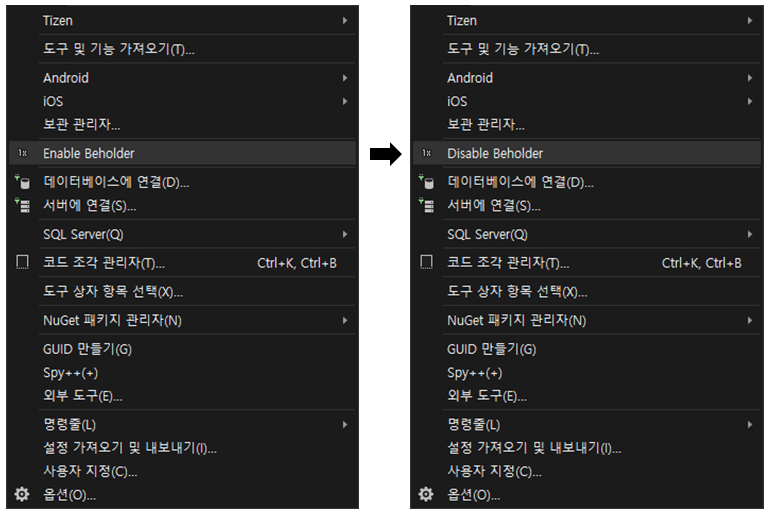
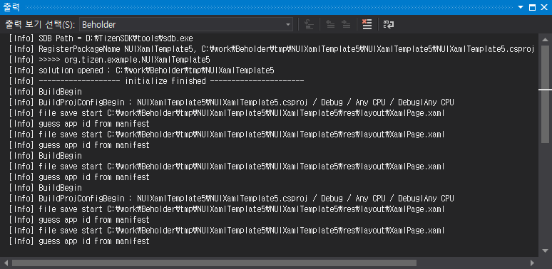

# Quick Start

## Install with Private Feed

Add this feed to Your VS Extension private gallery.
* https://nui-dali.github.io/Beholder//gallery/feed.xml

## To add a private gallery to Extensions and Updates

1. On the menu bar, choose **Tools > Options**.
2. In the **Environment** node, select **Extensions and Updates**.
3. Choose the **Add** button.
4. In the **Name** field, enter a name for the Beholder.
5. In the **URL** field, enter the URL.

## Install extensions from a private gallery

To search for and install extensions from a private gallery

1. On the menu bar, choose **Tools > Extensions and Updates**.
2. In the left pane, select **Online Extensions**, and then select **Beholder**.
3. In the right pane, select an **Tizen.NUI.Hotreloading**, and then choose the **Download** button.

You can learn more about how to install your personal gallery in [this MS article](https://docs.microsoft.com/ko-kr/visualstudio/extensibility/private-galleries?view=vs-2019).

# How to Use it

1. Open your NUI project.
2. On the menu bar, choose **Tools > Enable Beholder**.
3. On the menu bar, choose **Debug > Run without Debug**.
4. Open and Edit the xaml file
5. Save the xaml file

Now beholder is still in alpha test, you can see more information in the output window of Visual Studio.

# Known Issue

There is a delay of several seconds during the first hotreloading.